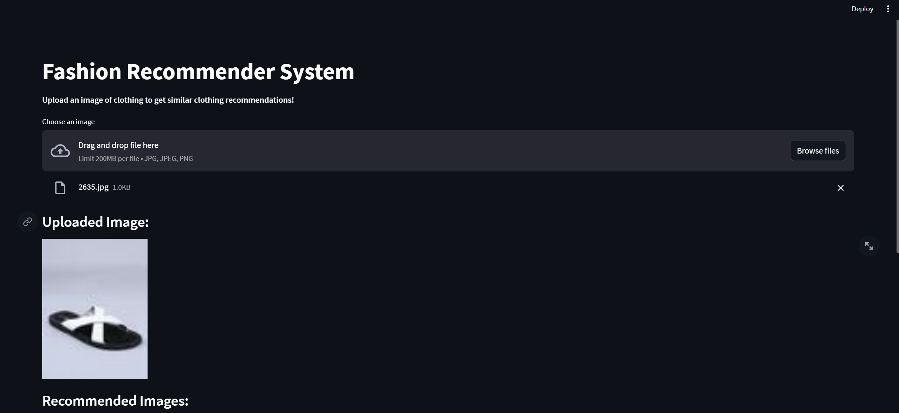
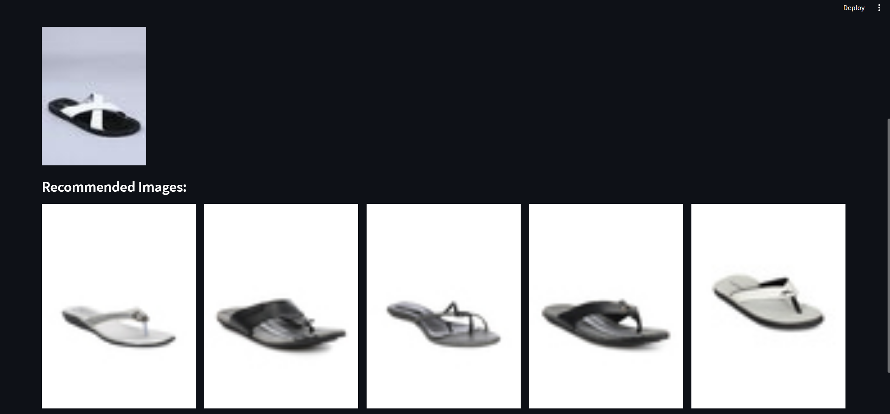

# Fashion Recommendation System  

A Deep Learning-powered **Fashion Recommendation System** that provides similar clothing suggestions based on an uploaded image. The application leverages the **ResNet50 model** for feature extraction and utilizes a user-friendly interface built with **Streamlit**.  

---

## 🎯 Features  

- **Upload and Recommend**: Users can upload a clothing image, and the system recommends visually similar clothing items.  
- **Deep Learning Powered**: Features are extracted using a pre-trained **ResNet50** model, fine-tuned for fashion data.  
- **Interactive Interface**: Built with Streamlit, the app provides an intuitive user experience with seamless recommendations.  

---

## 🛠️ Tech Stack  

- **Deep Learning**: TensorFlow, ResNet50  
- **Web Framework**: Streamlit  
- **Data Processing**: NumPy, Scikit-learn  
- **Image Handling**: PIL  
- **Model Training Dataset**: 44,000+ clothing images  

---

## 🚀 How It Works  

1. The ResNet50 model is used to extract high-dimensional features from the uploaded image.  
2. Extracted features are normalized and compared against a pre-computed feature list (stored in `embeddings.pkl`) using **Nearest Neighbors**.  
3. Based on similarity scores, the top 5 visually similar clothing images are displayed.  

---

## 📷 Interface Preview  

### Uploading an Image  
  

### Recommended Results  
  

---

## 🧠 Model Details  

- **Base Model**: ResNet50 (Pre-trained on ImageNet)  
- **Feature Extraction**: Global Max Pooling applied to extracted convolutional features.  
- **Similarity Search**: Nearest Neighbors algorithm with Euclidean distance.  

---

## 📌 To-Do  

- Add support for additional clothing categories.  
- Explore other state-of-the-art models for better feature extraction.  
- Deploy the application on cloud platforms like Heroku or AWS.  

---

## 🧑‍💻 Getting Started  

### Prerequisites  

Make sure you have the following installed:  
- Python 3.8+  
- TensorFlow, Streamlit, NumPy, Scikit-learn  

### Installation  

1. Clone the repository:  
   ```bash
   git clone https://github.com/HasanCan6241/fashion-recommendation-system.git  
   cd fashion-recommendation-system  
